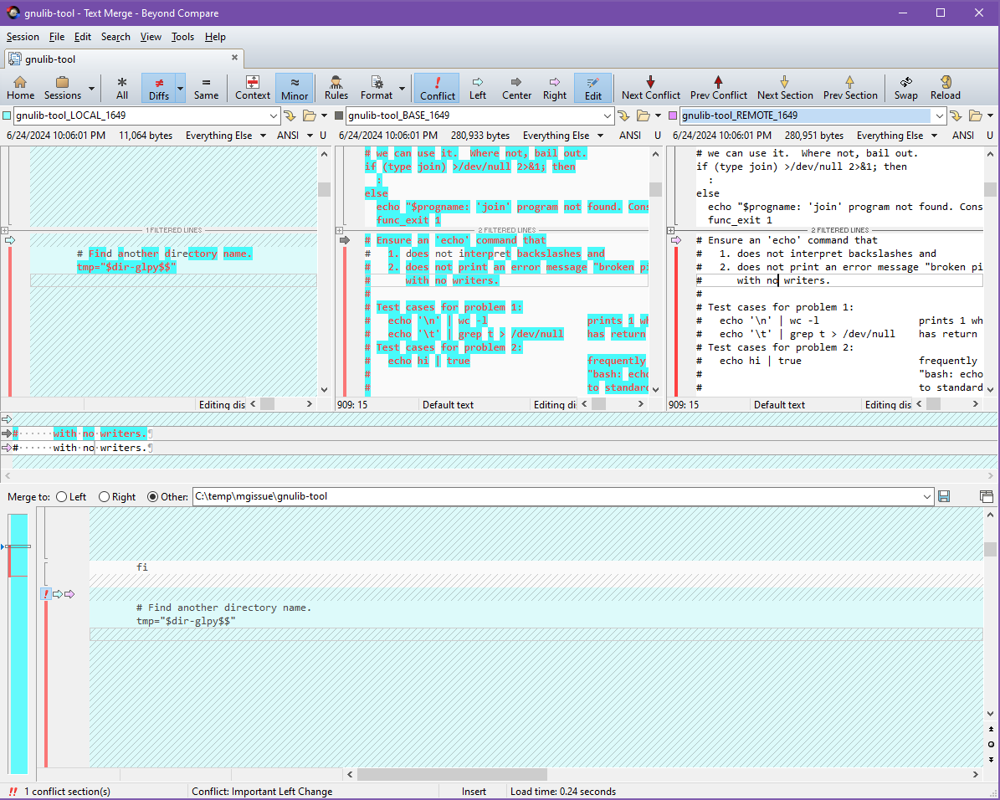
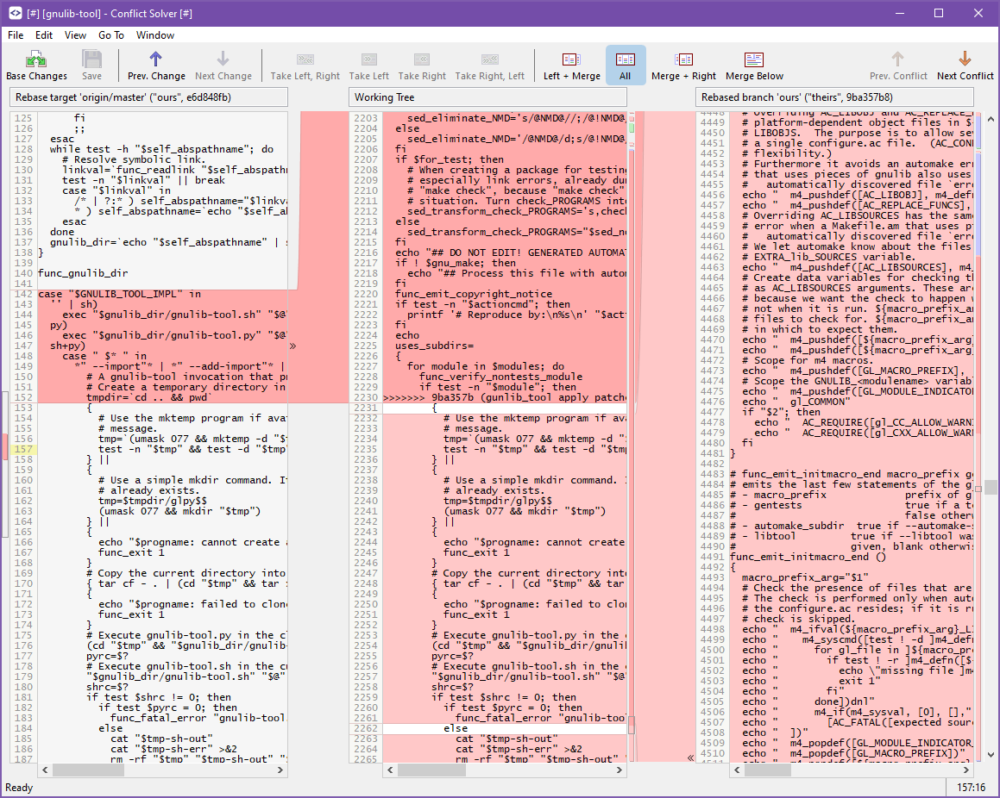

# Comparison of SCM Merge Tools for 3 Way Conflicts
This is an evaluation of the way dozens of merge tools handle common ancestor conflict resolution and what I often see as a problem.  It also had some comparison tables and tests to show the various features of most of the available merge tools.

I find some git merge conflicts seem to be unnecessarily complicated and I don't know why. Don't get me wrong, I have done plenty of conflict merges without issue but every now and then simple ones seem near obfuscated when I open most mergetools.

The initial example shown here is a one line code change to a file. When going to rebase onto master the conflict representation seems overly complicated in most tools. Here is the difference: [mitchcapper/merge_tests/gnulib_master...gnulib_ours](https://github.com/mitchcapper/merge_tests/compare/gnulib_master...gnulib_ours)
```diff
     for patchfile in $lkpatches; do
       IFS="$save_IFS"
-      patch -s "$tmp/$lkbase" < "$patchfile" >&2 \
+      patch --ignore-whitespace -i "$patchfile" "$tmp/$lkbase" >&2 \
         || func_fatal_error "patch file $patchfile didn't apply cleanly"
     done
```

Still most merge tools show the conflict like:

[](merge_tool_bad1.png)
[](merge_tool_bad2.png)

Just jumping into the conflict resolution during a rebase and it can be quite hard to understand what happened or what the original change was.  Here the local branch had a one line modification to make the application of patches to read the patch from a file and ignore whitespace.  Upstream the script had some larger rewrites completely replacing that section.  Now some merge tools have a few stand out features, many look just like above or worse.  Maybe I am missing some key aspect of using these tools but if so I have no idea what it is.

## Table of Contents
<!-- MarkdownTOC -->

- [Feedback Welcome](#feedback-welcome)
- [One Line GNULib Simple Merge Test](#one-line-gnulib-simple-merge-test)
- [Tooling or User Error?](#tooling-or-user-error)
	- [Don't use a merge tool, idiot](#dont-use-a-merge-tool-idiot)
- [Recurring Problematic Themes](#recurring-problematic-themes)
- [Additional Merge Example Cases](#additional-merge-example-cases)
- [The Merge Tool Tests / Features](#the-merge-tool-tests--features)
	- [Merge Tool Features Table](#merge-tool-features-table)
	- [Merge Tool Test Results Table](#merge-tool-test-results-table)
- [Merge Tool Links / Tool Specific Notes](#merge-tool-links--tool-specific-notes)
- [Favorite Tools and Deal Breakers](#favorite-tools-and-deal-breakers)
	- [JetBrains IntelliJ](#jetbrains-intellij)
	- [Beyond Compare](#beyond-compare)
	- [KDiff3](#kdiff3)
- [Future Tool Hopes](#future-tool-hopes)
	- [4 Panes](#4-panes)
	- [Quick Merge Strategy / Driver Testing](#quick-merge-strategy--driver-testing)
	- [AI Merging](#ai-merging)
	- [Other Minor Improvements](#other-minor-improvements)
- [Not Considered](#not-considered)
- [Merge Tool Screenshots](#merge-tool-screenshots)

<!-- /MarkdownTOC -->

## Feedback Welcome
If you know of a merge tool I don't list below (that has a Windows option) or any other feedback (ie how I am a dumbass missing something key) my contact information can be found on my [GitHub page](https://github.com/mitchcapper/).  The test repo [mitchcapper/merge_tests](https://github.com/mitchcapper/merge_tests) contains several test cases in branches to test merge tools on various issues but we start with the above primary example.


## One Line GNULib Simple Merge Test

To test the above example I put this micro (1/4 megabyte) repo together to reproduce (stripping down the original repo). Is this quick for you to resolve with your setup? Just run:

```
git clone https://github.com/mitchcapper/merge_tests .
git checkout gnulib_ours
git rebase origin/gnulib_master
```

and you will end up in a conflict state (run git mergetool to launch your normal tool).  This is not a contrived problem, this is an exact rebase I had which while it should have been straightforward (see if patch is still used in the script if so modify its invocation if not code is no longer needed).

## Tooling or User Error?

I would assume this is mostly a tooling/process issue, but I have tried just about every 3 way mergetool with a Windows option (about two dozen total).  Maybe I am just using these tools wrong, or expecting too much of my merge tools.  If I reviewed every commit on both sides of a conflict before merging the conflict I would be in a better position (but still for many tools would need two windows open to see the exact original changes while also doing the merging).  Reviewing (or already knowing) all the code involved is time consuming, especially if you are only having to work with it sporadically and its often other people's code.  We often use 3rd party libraries or work with other developers for the explicit purpose of not having to know every inch of the code bases involved. Often for doing semi-complex conflict merges I need 3 windows open/tabbed between.  The merge tool, and then two applications or terminals for reviewing the exact commits on each branch involved in the conflict.

None of these are generally the IDE you code in, meaning you likely don't have those normal comforts (say code completion) and don't have the exact same key shortcuts.  As someone who may switch between a half dozen programming languages in a short period of time, and can't remember the exact syntax for all of them, this leads to trouble.  It means I may have compiler errors (or worse runtime script errors) by my manual merging (or even the auto merging). I can potentially have my IDE open (as a 4th window) as I am doing this but that isn't always as useful.  Often the actual files will have the standard git conflict blocks in them pre-merge.  This means you can't really partially compile as you are merging. In addition, as the IDE isn't the merge tool coding directly in the IDE means you don't have the visibility into the merge changes and are now switching back and forth for those as well.

### Don't use a merge tool, idiot
Plenty of people don't use merge tools at all (or rarely).  The newer [zdiff3](https://www.ductile.systems/zdiff3/) conflict marking style from git often can provide enough inline context to resolve many conflicts right in the file.  Still, while I do use zdiff3 I generally find merge tools offer many features that are beneficial.  A big one is an easier ability to look at all the changes on both sides without having to do a bunch of file searching (git cli will do this to some degree as well but not most IDE's). The biggest case for not using a merge tool I think is the ability to stay in your normal IDE and have that feature set.  Conflict markers are going to make most code not able to compile though so one can't just test as you go very easily.  Sometimes I may just use the diffs for a changeset but manually applying each change through copy and paste is more error prone to missing something or causing a more innocuous formatting change that I would need to correct later on.

## Recurring Problematic Themes

You can find screenshots below, feature comparisons of each tool, and what specifically the issues were but there were recurring patterns:

- Even tiny changes in one branch can be nearly impossible to understand what happened when there are much larger changes from the other branch.

- For many merge tools, especially 3 pane only merge tools, there can literally be no way to visibly see the original change vs base when merging.  In the one line change used here even if I scroll directly to that change in the code in over a third of the tools tested there is no visible way for me to tell that one line is all that was changed (or what that change was).  It can just appear in a blob of red of code no longer in the alternate branch making it quite impossible to know what I need to be doing. Even some four pane merge tools I would have to use my eyes to visually diff the one branch change against the base next to it as that is not what it is using the diff highlighting to show (and is not easy to toggle to that option).

- Most merge tools are nearly VCS unaware. While there is a case they shouldn't have to be, the more context they can provide often the easier the job is. The more applications I need to work with and tab between the more laborious merges can be. If using a git UI frontend program they can make reviewing the conflicted commits easier but often have poor native merge tools.  This means I am tabbing into the UI application to see what the change was (and potentially copying that code) then back into the merge program to try and figure where in the alternate branches code to make those changes.  It may even involve having a second copy of that UI application (or a 3rd terminal session) open to try and look at the commits in the upstream branch that happened to understand how that code is working.  Three windows to have the context required and (as mentioned above) these are frequently not your coding IDE.

- Auto merging can be non existent in some tools to down right dangerous in others.  Some tools may *believe* they merged successfully and not even mark that area as potential conflict, but really have done a poor job of it and it is hard to catch that. Again, a case can be made your merge tool shouldn't do doing the attempted merging but rather rely on git (or whatever SCM) to do it.  Not all tools also make it obvious what parts were auto merged by git, vs themselves, vs just code the user has already merged making it a bit harder to know what to review.  There are many places auto-merging can happen.  Git has its own slew of [merge strategies](https://git-scm.com/docs/merge-strategies).  Most merge tools have rules or potentially structure understanding to be able to ignore things that don't matter (or are configurable).  Finally there are git's native and 3rd party [merge drivers](https://git-scm.com/docs/gitattributes#_built_in_merge_drivers). These are less common, and git is setup to specify these on a file type basis rather than as a strategy or tool basis.  In some cases this makes sense, to merge an archive automatically I need something that understands archives.  If the two branches each added a different file to a tar binary (in scm?) no manual merging should be required.  The other use of merge drivers though can simply be tools that have a better understanding of that file type.  An example is included here with the Mergiraf.  It isn't a merge tool, but can essentially take a first pass attempt at further auto-merging some problems that common merge patterns will not be able to handle. A few merge tools allow you to pick merge strategies they manually call on git with, or have internally, although generally they are not meant for fast switching.


I get that I could do two way comparisons manually or review each commit, and that it would be great to have full code understanding of the entire file I am working with.  Still when there are dozens of files to merge in a short time this is not practical to do efficiently so this sort of disconnect merge tools cause makes it much harder to do.


## Additional Merge Example Cases
For each test you will find the `[test]_master` branch containing the initial commit `[test]_ours` containing a first commit and `[test]_upstream` containing a conflicting commit.  To test the merge client do a `git checkout [test]_ours` then `git merge [test]_upstream`.  For more details see the [tests repo](https://github.com/mitchcapper/merge_tests).  The test branches include:

- [gnulib](https://github.com/mitchcapper/merge_tests/compare/gnulib_master...gnulib_ours) - The initial one line gnulib_tool change that provided the basis for these tests
- [guiffy](https://www.guiffy.com/SureMergeWP.html#tck1) - The test cases the Guiffy merge tool provides as sample merge issues (documents real world problems but certainly something their tool will handle well)
- [mergiraf](https://mergiraf.org/conflicts.html) - Test cases showing off real world issues their merge driver handles well
- [whiteinge](https://github.com/whiteinge/diffconflicts/tree/master) - A short conflict set of merges showing a few distinct cases

## The Merge Tool Tests / Features
Note:  This is primarily focused on the features around and testing the 3 way conflict merges of these tools.  It does not generally speak to the other unique features of the tools or benefits they may present.   Things like Git Kraken and Fork technically contain 3 way merge tools so are included but their primary functions are not merge related.  This means they generally do poorly on most merge related items, but doesn't make them bad tools.  The [Merge Tool Links / Tool Specific Notes](#merge-tool-links--tool-specific-notes) section links to the homepage for each tool and the - [Merge Tool Screenshots](#merge-tool-screenshots) section has screenshots of each tool.  Nearly all the tools mentioned have most of the basics for merge tools (ie free form editing, any tools that doesn't let you manually edit lines is crazy to think about doing complex merges with).

Notes on some of the columns:

- 4-page merge means often showing not just the resulting merge file but also the base file (and hopefully the ability to see the differences of each branch to each of those)
- Ability to easily swap panes, given the fact it can be hard to tell what was always changed by who the ability to direct compare whatever two panes you want can help with this.  Editors that allow completely hiding a pane and its change set temporarily even better.  Some tools though when you do this (ie change to a two pane view) do so destructively so you can't just go back to the normal merge view.
- Git Commit Context. Many merge editors don't have much source control integration (other than being possible to use with popular source control systems).  Those that do, (AKA allowing easy access to the commit history and notes) have a leg up.
- Toggle Originals - Most of the time a good 4 pane merge tool is all that is needed for understanding changes.  Sometimes though it is useful to be able to quickly toggle back to the original pre-merge version of things for what each set of changes were.  For 3-pane merge tools if they don't have the ability to toggle the base view instead of just the result view it can be a real problem.
- Custom Alignment - This means aligning two panes from a scrolling/section POV.  Most merge tools don't have any alignment problems but with some tricky merges getting proper context/diffs is only possible with manually aligning certain sections. Tools that have less strong auto-alignment can benefit more from custom alignment as well.
- Custom Language Logic - this can mean things like being able to ignore the order of fields when they  don't matter, or being able to better understand semantic language specific blocks of code to better follow moves or provide context to what is going on.  Sadly even when tools had semantic understanding it often seemed like it wasn't really taken advantage of for the merging.

### Merge Tool Features Table
Green = has feature, Yellow = partial feature support, White = missing feature, Purple = conditions apply to the feature working (see [Merge Tool Links / Tool Specific Notes](#merge-tool-links--tool-specific-notes) for that tool for details ).
|   **Merge Tool**   | **Syntax Highlighting** | **Word Wrap** | **4 Pane Merge** | **Custom Language Logic** | **Custom Alignment** | **Search** | **Git Commit Context** | **Easily Swap Panes** | **Easily Hide Panes** | **Toggle Originals** |
|:------------------:|:--------------------:|:-----------:|:-------------:|:-----------------------:|:-----------------:|:--------:|:-------------------:|:-------------------:|:------------------:|:------------------:|
|    Araxis Merge    |          🟢          |     🟢     |       ⚪      |           ⚪           |         🟢        |    🟢   |          ⚪         |         🟢         |         🟢         |         ⚪        |
|   Beyond Compare   |          🟢          |     ⚪     |       🟢      |           🟡           |         🟢        |    🟢   |          ⚪         |         🟢         |         🟢         |         ⚪        |
|    Code Compare    |          🟢          |     🟢     |       ⚪      |           🟣           |         ⚪        |    🟢   |          ⚪         |         🟢         |         🟢         |         🟢        |
|     DeltaWalker    |          🟢          |     🟢     |       ⚪      |           ⚪           |         ⚪        |    🟢   |          ⚪         |         🟢         |         ⚪         |         ⚪        |
|      DiffMerge     |          ⚪          |     ⚪     |       ⚪      |           ⚪           |         🟢        |    🟢   |          ⚪         |         🟢         |         🟢         |         🟢        |
|       ECMerge      |          🟢          |     🟢     |       🟢      |           ⚪           |         🟢        |    🟢   |          ⚪         |         ⚪         |         ⚪         |         ⚪        |
|      ExamDiff      |          🟢          |     🟣     |       🟢      |           🟣           |         🟢        |    🟢   |          ⚪         |         🟢         |         ⚪         |         ⚪        |
|        Fork        |          ⚪          |     ⚪     |       ⚪      |           ⚪           |         ⚪        |    🟢   |          🟡         |         ⚪         |         ⚪         |         ⚪        |
|      GitKraken     |          🟢          |     🟢     |       ⚪      |           ⚪           |         ⚪        |    🟢   |          ⚪         |         ⚪         |         ⚪         |         ⚪        |
|  Guiffy SureMerge  |          🟢          |     ⚪     |       ⚪      |           ⚪           |         🟢        |    🟢   |          ⚪         |         🟡         |         ⚪         |         ⚪        |
| JetBrains IntelliJ |          🟢          |     🟢     |       ⚪      |           ⚪           |         ⚪        |    🟢   |          🟢         |         🟢         |         🟢         |         🟢        |
|       KDiff3       |          ⚪          |     🟢     |       🟢      |           ⚪           |         🟢        |    🟢   |          ⚪         |         🟢         |         🟢         |         ⚪        |
|        Meld        |          🟢          |     🟢     |       ⚪      |           ⚪           |         🟢        |    🟢   |          ⚪         |         🟢         |         ⚪         |         ⚪        |
|      Mergiraf      |          ⚪          |     ⚪     |       ⚪      |           🟢           |         ⚪        |    ⚪   |          ⚪         |         ⚪         |         ⚪         |         ⚪        |
|      p4 Merge      |          🟢          |     ⚪     |       🟢      |           ⚪           |         ⚪        |    🟢   |          ⚪         |         ⚪         |         ⚪         |         ⚪        |
|      SmartGit      |          🟢          |     ⚪     |       ⚪      |           ⚪           |         ⚪        |    🟢   |          ⚪         |         🟢         |         🟢         |         🟢        |
|    Sublime Merge   |          🟢          |     🟢     |       ⚪      |           ⚪           |         ⚪        |    ⚪   |          ⚪         |         ⚪         |         ⚪         |         🟡        |
|       tkdiff       |          ⚪          |     ⚪     |       ⚪      |           ⚪           |         🟢        |    🟢   |          ⚪         |         ⚪         |         ⚪         |         ⚪        |
|    Tortise Merge   |          ⚪          |     🟢     |       ⚪      |           ⚪           |         ⚪        |    🟢   |          ⚪         |         ⚪         |         ⚪         |         ⚪        |
|       VimDiff      |          🟢          |     🟢     |       🟢      |           ⚪           |         ⚪        |    🟢   |          ⚪         |         🟢         |         🟢         |         ⚪        |
| Visual Studio Code |          🟢          |     🟢     |       🟢      |           ⚪           |         ⚪        |    🟢   |          🟡         |         🟢         |         ⚪         |         ⚪        |
|      WinMerge      |          🟢          |     🟢     |       🟢      |           ⚪           |         🟢        |    🟢   |          ⚪         |         🟢         |         ⚪         |         ⚪        |

### Merge Tool Test Results Table
This is how each tool did in terms of display and merging the different branch tests outlined above.

Green = good or great implementation, Yellow = sometimes works or middling support, White = missing, Red = failed or frequently doesn't provide desirable results, Purple = conditions apply to the feature working, ie only certain languages (see [Merge Tool Links / Tool Specific Notes](#merge-tool-links--tool-specific-notes) for that tool for details ).
|   **Merge Tool**   | **gnulib show local line diff** | **Initial Position on our line** | **Merigraf Merges** | **Guiffy Merges** | **Whiteinge Merges** |
|:------------------:|:---------------------------------:|:--------------------------------:|:---------------------:|:-------------------:|:---------------------:|
|    Araxis Merge    |                🟢                |                 ⚪                |          🔴          |         🔴         |           🔴          |
|   Beyond Compare   |                🟢                |                 ⚪                |          🔴          |         🟡         |           🟡          |
|    Code Compare    |                🟡                |                 ⚪                |          🔴          |         🔴         |           🔴          |
|     DeltaWalker    |                🟣                |                 ⚪                |          🔴          |         🔴         |           🟢          |
|      DiffMerge     |                🟡                |                 ⚪                |          🔴          |         🔴         |           🔴          |
|       ECMerge      |                🟢                |                 ⚪                |          🟡          |         🔴         |           🟡          |
|      ExamDiff      |                🔴                |                 ⚪                |          🔴          |         🔴         |           🔴          |
|        Fork        |                🔴                |                 ⚪                |          🔴          |         🔴         |           🔴          |
|      GitKraken     |                🔴                |                 ⚪                |          🔴          |         🔴         |           🔴          |
|  Guiffy SureMerge  |                🟡                |                 ⚪                |          🔴          |         🟢         |           🔴          |
| JetBrains IntelliJ |                🟢                |                 ⚪                |          🟣          |         🟡         |           🔴          |
|       KDiff3       |                🟢                |                 🟢                |          🟡          |         🔴         |           🟡          |
|        Meld        |                🔴                |                 ⚪                |          🔴          |         🔴         |           🔴          |
|      Mergiraf      |                ⚪                |                 ⚪                |          🟣          |         🟡         |           ⚪          |
|      p4 Merge      |                🔴                |                 ⚪                |          🔴          |         🔴         |           🔴          |
|      SmartGit      |                🟡                |                 ⚪                |          🔴          |         🔴         |           🔴          |
|    Sublime Merge   |                🔴                |                 ⚪                |          🔴          |         🔴         |           🔴          |
|       tkdiff       |                🔴                |                 ⚪                |          🔴          |         🟡         |           🟢          |
|    Tortise Merge   |                🔴                |                 ⚪                |          🔴          |         🔴         |           🔴          |
|       VimDiff      |                🟣                |                 ⚪                |          🔴          |         🔴         |           🔴          |
| Visual Studio Code |                🟢                |                 ⚪                |          🔴          |         🔴         |           🔴          |
|      WinMerge      |                🟢                |                 ⚪                |          🔴          |         🔴         |           🔴          |


## Merge Tool Links / Tool Specific Notes
Below are the merge tools tested and links to their homepages. If a feature is covered in one of the tables above it is generally not repeated unless more context is needed. A big example of that are tools that fail to visibility highlight the single line change as noted above is a pretty major issue but I won't re-mention below.

- [Araxis Merge](https://www.araxis.com/merge/index.en) - As long as it doesn't completely auto merge things on load the initial visual diffing is fairly easy to understand.
- [Beyond Compare](https://www.scootersoftware.com/) - Issues with showing single line unless auto merge turned off. Was able to autofix many of the giffey cases.  For smaller change blocks generally able to easily see issues. For merigraf merges were almost always incorrect but would at least show as conflicts (rather than showing it successfully merge those blocks).
- [Code Compare](https://www.devart.com/codecompare/) - Has some interesting language specific knowledge for C# and a few others but VS is required for that and last supported version is 2017.  Generalized merge still has issues.  Have to toggle between base and result. It also has AST like language understanding for multiple languages but doesn't seem to use to assist merges.  It does work to show what functions were changed though in a merge which is a nice feature.
- [DeltaWalker](https://www.deltawalker.com/) - Shows more conflicts than needed need to manually select to merge non-conflicting differences.  Once you do it no longer properly highlights the single line change instead showing it as just a block of red.  Part of the issue is due to the lack of a 4 pane merge so you only can compare against the current result.  It can also be hard to get to actual conflict.
- [DiffMerge](https://www.sourcegear.com/diffmerge/) - Has a "reference" tab with the original files you can easily switch to when merging to help make up for its lack of 4 pane merges.  Has a conflict map/outline although hard to read for some of our test conflicts (like the single line example).
- [ECMerge](https://www.elliecomputing.com/en/Products/merge_overview.asp) - Provides a nice summary on start, can set a target pane to be able to load existing files or docs from explorer/CLI into a slot.  Quite configurable.  Shows our one line change and has a button that goes right to our one line change (next difference inside line).  It's automerge support though is a bit weak.
- [ExamDiff](https://www.prestosoft.com/edp_examdiff.asp) - Very hard to tell what each side did.  Despite being a 4 pane merge you can't see the single line change.  There is a wordwrap option but it didn't seem to effect anything in a 3 way merge.  It also has AST like language understanding for multiple languages but doesn't seem to use that during merges.
- [Fork](https://git-fork.com/) - Very basic 3-way merge support not the primary goal of the tool.
- [GitKraken](https://www.gitkraken.com/) - Nice UI but very basic merge tool, no direct editing so other than for the most basic of merges I doubt anyone would want it for merging.
- [Guiffy SureMerge](https://www.guiffy.com/SureMergeWP.html) - Provides summary on start of a merge but only a three pane merge system.  This makes it very hard to see changes with base even when scrolled to.  Does have easy ability to compare either with the parent making it easier to see original to partially make up for that.  It was a source for a great set of test cases that we used for all the others (although it did seem to not be able to automerge one of its own tests but that might have been my git config).  Despite doing well on its own merge cases, for the 3rd party merge tests it didn't do nearly as good even though some seemed similar. The UI is somewhat dated.
- [JetBrains IntelliJ](https://www.jetbrains.com/idea/) - Initial merge window isn't great, but they have buttons to show you the commit history on a per pane basis so you can see what each commit did (easily open a diff) and the commit messages. Unfortunately the "see details" button that allows this only seems to show up when launched from within IntelliJ itself, but if used as a mergetool on the command line the see details/ commit history buttons do not appear.  File search also does not work when launched from the command line.  It doesn't have next conflict only next difference but does also feature a magic attempt by them to merge.  After their auto merging though the diffs become harder to read (given its 3 pane) so the result is less clear.  Works quite well on merigraf tests as long as it knew the language for that specific file.  It also was one of the only merge tools to have shell language support out of the box including semantic structure understanding.  They also support doing git blame right in the merge window per pane which is fantastic for further understanding the code.
- [KDiff3](https://download.kde.org/stable/kdiff3/) - Was the only editor where it was immediately visible what the local one line change was.  It has a large feature set and easily made it as one of my favorites (see that for more details.
- [Meld](https://gitlab.gnome.org/GNOME/meld) - Modern looking design and nice overview visualization.  Being a 3 pane not 4 pane merge it fails the common case of being unable to see the single line change and doesn't have some of the better diff highlighting that other 3 pane tools do.  Has syntax highlighting but its per pane rather than for all 3 oddly.
- [Mergiraf](https://mergiraf.org/) - Technically a merge driver that uses AST trees to better attempt merges. It can also be used with other merge tools in that regard.  Only works with certain languages it can understand. You can have to apply to all merges by default but that was a bit too aggressive for me, I prefer to selectively apply it when I think it might be useful.
- [p4 Merge](https://www.perforce.com/manuals/cmdref/Content/CmdRef/p4_merge.html) - Hard to see changes even when conflict scrolled to. Even though it is a 4 pane merge tool it actually doesn't highlight the single line change disappointingly.  I used P4 merge for probably a decade+ sadly it doesn't seem to have changed much in the nearly two decades since then.
- [SmartGit](https://www.syntevo.com/smartgit/) - Nice labels on branches, base changes button is nice to see history easily, merge window can't be adjusted (the pane dividers) though making it a pain.  Doesn't work well with diff3 formatting if set in your git settings (even its recreate conflict doesn't override that causing the issue to persist).  While its lack of four pane merge does mean the initial single line change is not available, given how easy it is to tab to the base changes it gets partial credit for being easy to see.
- [Sublime Merge](https://www.sublimemerge.com/) - smerge.  No Searching, can switch between base and merged in center pane but still hard to understand changes as neither shows our one line change.  Many tools with a base toggle make it easy to see original changes but the local/remote diffs don't change when toggling back to base.  Synchronized scrolling does not work well to show our change for hte original.  Supports auto-complete/intellisense.
- [tkdiff](https://sourceforge.net/projects/tkdiff/) - Only shows two panes the merged pane is floating in the middle.  Syncing is a bit odd too and can't tell one line change.  Does not keep merged scrollbar in sync.
- [Tortise Merge](https://tortoisesvn.net/TortoiseMerge.html) - Conflict is all question marks so you can't miss it but also adds a lot of visual clutter.  Sadly has most of the issues 3-pane merge tools can have as well.
- [VimDiff](https://vimdoc.sourceforge.net/htmldoc/diff.html) - Hard to see single line conflict when scrolled to.  Clearly designed for vim users so others would find it a bit hard.  Better theming (which I am sure I could do) would probably fix some of the issues I ran into.
- [Visual Studio Code](https://code.visualstudio.com/docs/sourcecontrol/overview) - Found [bug #192580](https://github.com/microsoft/vscode/issues/192580#issuecomment-2002333816) in VS that makes the basic merge case hang for many minutes that is fun.  It does highlight our single line change when scrolled to but hard to see changes.  Easily does allow you to open a new tab just comparing one version with base though which helps.
- [WinMerge](https://winmerge.org/?lang=en) - Doesn't do a whole lot of auto merging. Specifically calls itself out as (not a great)[https://github.com/WinMerge/winmerge/discussions/1853#discussioncomment-5906464] 3 way merge tool.


## Favorite Tools and Deal Breakers
This isn't very scientific but some personal thoughts for high merge uses.  I generally have a good bit of code to merge, and sometimes I haven't seen either the local or remote code for months so the more context the tool gives me the better.  While a four pane merge tool is not required many of the three pane ones lose all visible context to the original change especially after auto merged content.  On our single line change you often can't tell that line was changed.  Exceptions are things like IntelliJ or WinMerge which while being 3 pane do still properly highlight the change.

Having the full git commit context in a merge tool is not exactly its job (one could be pairing with a UI like Fork or Kraken to get better information on the merge conflict).  It is faster and nicer to have it fully integrated like with IntelliJ where you can one click see the details of the applicable commits for each pane.  Editors that allow switching to the originals can also be nice with complex file merges to make sure you know what the original commit changes were.

While syntax highlighting wouldn't seem like a big thing I find it helps to break up the solid blocks of color you would otherwise be looking at that can be hard to fully understand the changes.

All merge tools should allow things like selective staging, manual editing of the merged files, have search features, and preferably allow for flexible layouts/adjustments.  Auto-complete is nice but rarely found can be helpful to avoid errors given you are not in a normal compiler IDE (most of the time).

### [JetBrains IntelliJ](https://www.jetbrains.com/idea/)
Nice UI and some innovative features although the fact several don't work when invoked as a mergetool is unfortunate.  The git integration is fantastic though.  It is also java based and heavy so launch takes some of the longest times.  Not a big deal if you are leaving it open on a repo but not great with mergetool.  It also doesn't have a 4 pane merge option unfortunately but it is a highly capable 3 pane merge tool. Sadly the editor support with JetBrains is somewhat split with Rider their other IDE (good news is the merge tool is nearly the same).  This means some languages are really poorly supported (say c#) making merges more annoying with those language files.

### [Beyond Compare](https://www.scootersoftware.com/)
Has been my go-to merge tool for quite awhile. It supports 4 pane merges, syntax highlighting, its auto merging handles a good number of the additional tests as well.  It would be nice if it supported better git integration (say history and blame) but otherwise fairly well rounded and affordable.

### [KDiff3](https://download.kde.org/stable/kdiff3/)
Has many great features, the biggest issue is the lack of syntax highlighting.  What is odd is the 2022 changelog entry that says syntax highlighting was added for many languages.  Sadly if it does exist I can't find it in the product.  It is also the _only_ merge tool that actually jumped right to our single line change for that test.  It's look is a bit dated, but looks are not key in a merge tool and again it's **free**.

## Future Tool Hopes

### 4 Panes
I think merge tools offering 4 panes as an option is important.  This 4th pane is generally the "base" file (vs just the merged result). The ability to easily switch what the two branch panes are diffing to (base vs merged) can make longer merges easier.  Yes looking at each commits changes in another window can be necessary or preferred in certain circumstances but when I am merging many changes in one file being able to quickly see what I have done and what the original changes were all in one spot is helpful.  Not everyone may have the screen real estate for 4 pane layouts and certainly some tools feel that it is not beneficial, but allowing it an option for users is a plus.

### Quick Merge Strategy / Driver Testing
Git has a few different merge options/strategies and merge drivers, plus there are tools like Mergiraf (covered above) , not to mention each merge tool itself may have built in strategies/rules fixes etc. It would be great if a mergetool provided the ability to quickly re-evaluate a merge using an alternate tool/strat/app. If I am in the middle of a merge and all the sudden there is a section that looks hairy it would be great if I could open a second window in the mergetool and quickly select through a dropdown box of strategies / drivers that it applies and instantly shows what that output looks like on the code in a non-persistent way.  If I see something that looks better or makes sense I can just copy that into the existing merge window I am working on.  Sometimes these things can be applied in succession so maybe just buttons for each one could be even better with a reset / undo option to go back and be able to apply others.  Again, I think one would want this in a non-destructive, and often per file 'what if' way rather than reapplied to the entire merge (especially as one may have already started hand merging some things).  There are some tools out there like [Semantic Diff](https://semanticdiff.com/) that seem interesting but as they don't offer a merge driver as much as a UI around their custom merge understanding would likely not work for this sort of thing (unless vscode happens to be your merge tool of choice).  It sounds like Semantic Diff may move towards more merge support in the future though and that may allow better integration.

### AI Merging
Often I am not a fan of AI.  The rate it hallucinates or makes basic syntax or logic errors that even an intern level coder wouldn't make can easily waste more time than it saves.  As someone working in many programming languages, without a fantastic memory, syntax for each is often a challenge.  If an AI presents code that looks like it makes sense but uses some structure / code flow mechanism I don't normally use I might accept that code as generated.  To then find out oh that loop pattern actually doesn't exist, or creates some new local context that is going to mess with state is frustrating.  It is not the sort of error I am accustomed to catching in other peoples code.   RTFM ai:)  Still for merging AI may provide some valuable assistance. So far I have not seen many merge tools that use AI at all.  There is AI to try and summarize commits which is part of the way there.  AI is generally good at 'understanding' context quickly which is one of the major hurdles of conflict merges.  I may not have deep working knowledge (as I forgot or didn't right it in the first place) of the changes in one or both branches so it is less the coding directly as much as AI helping with context.  An example for AI to come in and say:
  The upstream changes were working to move to using a new external patch tool smooth-patch and reorganize how the initial patches are applied.  The local branch commit in conflict was specifying additional command line tools on the existing patch tool (patch) to have it apply the patch from file (rather than stdin) and ignore whitespace.  The local changes may no longer be needed as smooth-patch reads patches directly from the file by default and has a more lenient whitespace policy. If additional args to smooth-patch are required: it is no longer called from gnulib-tool directly but instead is called from the code in gnulib/lib.sh line #63 here.  The code is gnulib/lib.sh is largely the same as what was in the gnulib-tools script but moved there as gnulib-tool now calls a different path depending on if the python version is available. Finally, as upstream is rewriting gnulib-tool in a python form there is a call to smooth-patch in gnulib/lib_python.py for when the python version is used to handle patching that you may also want to look at.

This might be something of a pipe-dream but manually figuring all those things out could take considerable time despite the problem being pretty straightforward.  If AI could even do a fraction of that it could greatly save time.  It is almost the concept of an AI Agent, but rather than an AI Agent acting as a controller for other AI it is advising the human on what they may want to do and why.

### Other Minor Improvements
- Having blame integrated into the merge tool like IntelliJ was interesting and could also help with understanding what certain code blocks do without having to go use a dedicated window to look at the blame info. Whatever keeps you from context switching the better.
- IntelliJ was the only application where commit breakdown was well integrated to the window rather than just the option to compare against base
- KDiff3 was the only tool that when opened on the conflict actually went to the single line change rather than the first spot the remote branch had changed the base.  This made it easier to see what the end goal was.  Per pane next/back conflict or difference movement would seem useful (beyond just global navigation).


## Not Considered

- [JDime](https://github.com/se-sic/jdime) - Java specific
- [Spork](https://github.com/ASSERT-KTH/spork) - Java Specific
- [Diffinity](https://truehumandesign.se/s_diffinity.php) - No 3 way merge
- [Plume](https://github.com/plume-lib/merging) - Mostly Java specific but adjacent lines and version numbers could apply to others.
- [Kompare](https://apps.kde.org/kompare/) - Not Windows
- [Kaleidoscope](https://kaleidoscope.app/) - Mac Only
- [xxdiff](https://github.com/blais/xxdiff) - Not Windows (maybe with gnu + old qt but didn't take the time to manually compile it
- [diffuse](https://diffuse.sourceforge.net/) - No 3 way merging
- [JetBrains Rider](https://www.jetbrains.com/rider/) - Mostly similar to IntelliJ around merging from brief evaluation.  As most of our test cases were in languages supported by IntelliJ not Rider did not include it in the tests.


## Merge Tool Screenshots
Below are screenshots of each tool and during different stages of merge conflicts with the branches in the test repo.   For the discussed gnulib single line merge I show the initial window when the tool first opens (potentially selecting go to first difference if required).  I then also show the merge tool scrolled to the exact single line change in local to illustrate how easy it is to see that change if you were not already aware that it was just that one line that was modified.  For the other tests generally I show the tool on the first conflict merge git cannot auto-resolve in the tool.  Git makes it pretty easy to call different mergetools that you have setup making it straightforward to do this sort of testing on your own.

| **Merge Tool**    | **gnulib initial** | **gnulib scrolled** | **Merigraf** | **Guiffy** | **Whiteinge** |
|:------------------|:-------------------|:-------------------|:-------------|:-----------|:--------------|
| Araxis Merge      | [gnu initial](merge_caps/araxis_initial.png) | [gnu single](merge_caps/araxis_scrolled.png) | [merigraf](merge_caps/araxis_mergiraf_initial.png) | [guiffy](merge_caps/araxis_guiffy_initial.png) | [whiteinge](merge_caps/araxis_whiteinge_initial.png) |
| Beyond Compare    | [gnu initial](merge_caps/bc_initial.png) | [gnu single](merge_caps/bc_scrolled.png) | [merigraf](merge_caps/bc_mergiraf_initial.png) | [guiffy](merge_caps/bc_guiffy_initial.png) | [whiteinge](merge_caps/bc_whiteinge_initial.png) |
| Code Compare     | [gnu initial](merge_caps/codecompare_initial.png) | [gnu single](merge_caps/codecompare_scrolled.png) | [merigraf](merge_caps/codecompare_mergiraf_initial.png) | [guiffy](merge_caps/codecompare_guiffy_initial.png) | [whiteinge](merge_caps/codecompare_whiteinge_initial.png) |
| DeltaWalker      | [gnu initial](merge_caps/deltawalker_initial.png) | [gnu single](merge_caps/deltawalker_scrolled.png) | [merigraf](merge_caps/deltawalker_mergiraf_initial.png) | [guiffy](merge_caps/deltawalker_guiffy_initial.png) | [whiteinge](merge_caps/deltawalker_whiteinge_initial.png) |
| DiffMerge        | [gnu initial](merge_caps/diffmerge_initial.png) | [gnu single](merge_caps/diffmerge_scrolled.png) | [merigraf](merge_caps/diffmerge_mergiraf_initial.png) | [guiffy](merge_caps/diffmerge_guiffy_initial.png) | [whiteinge](merge_caps/diffmerge_whiteinge_initial.png) |
| ECMerge          | [gnu initial](merge_caps/ecmerge_initial.png) | [gnu single](merge_caps/ecmerge_scrolled.png) | [merigraf](merge_caps/ecmerge_mergiraf_initial.png) | [guiffy](merge_caps/ecmerge_guiffy_initial.png) | [whiteinge](merge_caps/ecmerge_whiteinge_initial.png) |
| ExamDiff         | [gnu initial](merge_caps/examdiff_initial.png) | [gnu single](merge_caps/examdiff_scrolled.png) | [merigraf](merge_caps/examdiff_mergiraf_initial.png) | [guiffy](merge_caps/examdiff_guiffy_initial.png) | [whiteinge](merge_caps/examdiff_whiteinge_initial.png) |
| Fork             | [gnu initial](merge_caps/fork_initial.png) | [gnu single](merge_caps/fork_scrolled.png) | [merigraf](merge_caps/fork_mergiraf_initial.png) | | |
| GitKraken        | [gnu initial](merge_caps/kraken_initial.png) | [gnu single](merge_caps/kraken_scrolled.png) | [merigraf](merge_caps/kraken_mergiraf_initial.png) | [guiffy](merge_caps/kraken_guiffy_initial.png) | [whiteinge](merge_caps/kraken_whiteinge_initial.png) |
| Guiffy SureMerge | [gnu initial](merge_caps/guiffy_initial.png) | [gnu single](merge_caps/guiffy_scrolled.png) | [merigraf](merge_caps/guiffy_mergiraf_initial.png) | [guiffy](merge_caps/guiffy_guiffy_initial.png) | [whiteinge](merge_caps/guiffy_whiteinge_initial.png) |
| JetBrains IntelliJ| [gnu initial](merge_caps/intellij_initial.png) | [gnu single](merge_caps/intellij_scrolled.png) | [merigraf](merge_caps/intellij_mergiraf_initial.png) | [guiffy](merge_caps/intellij_guiffy_initial.png) | [whiteinge](merge_caps/intellij_whiteinge_initial.png) |
| KDiff3           | [gnu initial](merge_caps/kdiff3_initial.png) | [gnu single](merge_caps/kdiff3_scrolled.png) | [merigraf](merge_caps/kdiff3_mergiraf_initial.png) | [guiffy](merge_caps/kdiff3_guiffy_initial.png) | [whiteinge](merge_caps/kdiff3_whiteinge_initial.png) |
| Meld             | [gnu initial](merge_caps/meld_initial.png) | [gnu single](merge_caps/meld_scrolled.png) | [merigraf](merge_caps/meld_mergiraf_initial.png) | [guiffy](merge_caps/meld_guiffy_initial.png) | [whiteinge](merge_caps/meld_whiteinge_initial.png) |
| P4 Merge         | [gnu initial](merge_caps/p4merge_initial.png) | [gnu single](merge_caps/p4merge_scrolled.png) | [merigraf](merge_caps/p4merge_mergiraf_initial.png) | [guiffy](merge_caps/p4merge_guiffy_initial.png) | [whiteinge](merge_caps/p4merge_whiteinge_initial.png) |
| SmartGit         | [gnu initial](merge_caps/smartgit_initial.png) | [gnu single](merge_caps/smartgit_scrolled.png) | [merigraf](merge_caps/smartgit_mergiraf_initial.png) | [guiffy](merge_caps/smartgit_guiffy_initial.png) | [whiteinge](merge_caps/smartgit_whiteinge_initial.png) |
| Sublime Merge    | [gnu initial](merge_caps/smerge_initial.png) | [gnu single](merge_caps/smerge_scrolled.png) | [merigraf](merge_caps/smerge_mergiraf_initial.png) | [guiffy](merge_caps/smerge_guiffy_initial.png) | [whiteinge](merge_caps/smerge_whiteinge_initial.png) |
| tkdiff           | [gnu initial](merge_caps/tkdiff_initial.png) | [gnu single](merge_caps/tkdiff_scrolled.png) | [merigraf](merge_caps/tkdiff_mergiraf_initial.png) | [guiffy](merge_caps/tkdiff_guiffy_initial.png) | [whiteinge](merge_caps/tkdiff_whiteinge_initial.png) |
| Tortoise Merge   | [gnu initial](merge_caps/tortoisemerge_initial.png) | [gnu single](merge_caps/tortoisemerge_scrolled.png) | [merigraf](merge_caps/tortoisemerge_mergiraf_initial.png) | [guiffy](merge_caps/tortoisemerge_guiffy_initial.png) | [whiteinge](merge_caps/tortoisemerge_whiteinge_initial.png) |
| VimDiff          | [gnu initial](merge_caps/vimdiff_initial.png) | [gnu single](merge_caps/vimdiff_scrolled.png) | | | |
| Visual Studio Code| [gnu initial](merge_caps/vscode_initial.png) | [gnu single](merge_caps/vscode_scrolled.png) | [merigraf](merge_caps/vscode_mergiraf_initial.png) | [guiffy](merge_caps/vscode_guiffy_initial.png) | [whiteinge](merge_caps/vscode_whiteinge_initial.png) |
| WinMerge         | [gnu initial](merge_caps/winmerge_initial.png) | [gnu single](merge_caps/winmerge_scrolled.png) | [merigraf](merge_caps/winmerge_mergiraf_initial.png) | [guiffy](merge_caps/winmerge_guiffy_initial.png) | [whiteinge](merge_caps/winmerge_whiteinge_initial.png) |
